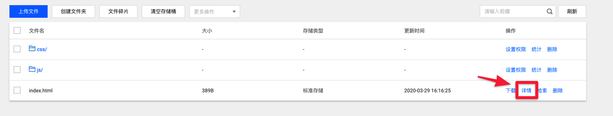
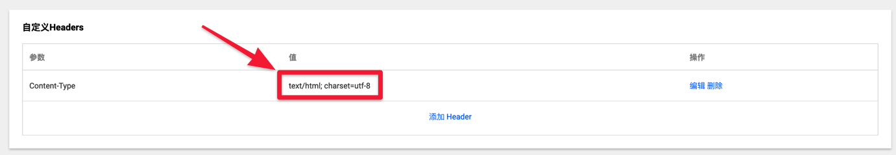
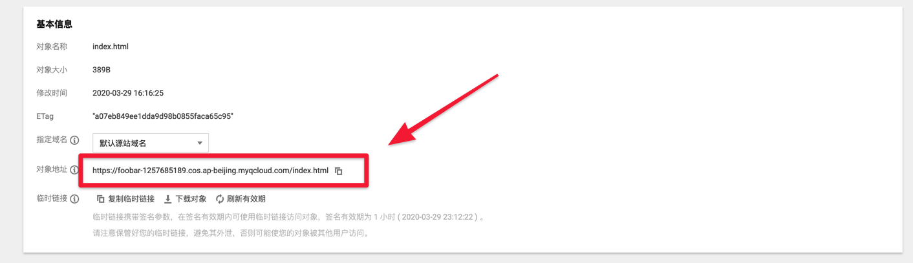

<h1 align="center">Welcome to 基于 Serverless 和 Vue 的豆瓣电影 Top 250 排行榜 👋</h1>
<p>
  <a href="https://twitter.com/fuergaosi" target="_blank">
    
  </a>
</p>

> 使用 Serverless 提供数据，使用 Vue 提供页面展示实现的豆瓣电影 TOP 250 排行榜

### ✨ [Demo](https://demo-1257685189.cos.ap-beijing.myqcloud.com/index.html)

## 如何开始
首先在本地拉取仓库
```sh
git clone https://github.com/fuergaosi233/DoubanTop250OnServerless.git
```
### 创建云函数
1. 安装所需依赖 运行一下命令
```sh
npm install -g serverless
cd backEnd && npm install
```
2. 部署服务, 在部署过程中会让你扫码登录，只需要扫码即可登录腾讯云账号，并自动创建服务。
```sh
sls --debug
```
3. 获取 `api` 地址，部署成功后会返回服务的各种信息格式如下：
```sh
  express: 
    functionName:        express_component_1dakwo
    functionOutputs: 
      ap-shanghai: 
        Name:        express_component_1dakwo
        Runtime:     Nodejs8.9
        Handler:     serverless-handler.handler
        MemorySize:  128
        Timeout:     3
        Region:      ap-shanghai
        Namespace:   default
        Description: This is a function created by serverless component
    region:              ap-shanghai
    apiGatewayServiceId: service-f20ew411
    url:                 http://service-f20ew411-1257685189.sh.apigw.tencentcs.com/release/
    cns:                 (empty array)
```
其中 `url` 的值即为接口地址。
### 创建前端页面
#### 构建静态资源
切换到 `frontEnd` 文件夹
```
cd frontEnd
```
由于使用了 Vue-cli 的快速原型开发 所以你需要安装一个全局的包
```
npm install -g @vue/cli-service-global
```
更改配置文件，将上个环节中的 Url 填写至 `config.js` 文件中 文件内容如下
```js
//config.js
const urls=[
  'https://service-bitqtpbh-1257685189.bj.apigw.tencentcs.com/release/getDouban', //此为你的 api 调用接口
]
export default urls[Math.floor(Math.random() * urls.length)];
```
然后安装所需的依赖并构建静态页面
```sh
yarn & vue build
```
#### 部署
在腾讯的[对象存储](https://console.cloud.tencent.com/cos5) 中创建一个新的存储桶，随后将dist目录中的文件上传至，存储桶中。
你的存储桶目录结构应该如下
```sh
├── css
├── index.html
└── js
```
#### 配置 COS
上传完成后选择 `index.html` 文件的`详情`选项，

为防止出现乱码 我们需要在详情部分的`自定义Headers`部分，指定编码方式。

最后 在`基本信息`部分我们就可以找到对象地址。

`对象地址`参数即是应用的地址，访问该 `Uri` 即可使用应用。

## 出现`服务器访问频率过高被风控，请过段时间再试。`是怎么回事。
由于在服务器使用了异步访问了豆瓣的 Top250排名页面，访问频率过高很容易被服务器拉黑，禁止访问。所以会出现如下报错。
解决方案有：
1. 给 Axios访问部分增加代理设置使用代理访问。
2. 添加豆瓣账号登录后的Cookie访问。 在云函数的环境变量中将 `COOKIE` 设置为登录豆瓣以后获取的 `COOKIE` 即可正确访问页面。
3. 构建多个异地云函数进行负载均衡，防止单一访问过多被拉黑。

## Author

👤 **Holegots**

* Website: https://blog.holegots.com
* Twitter: [@fuergaosi](https://twitter.com/fuergaosi)
* Github: [@fuergaosi233](https://github.com/fuergaosi233)

## Show your support

Give a ⭐️ if this project helped you!

***
_This README was generated with ❤️ by [readme-md-generator](https://github.com/kefranabg/readme-md-generator)_